# Equation Flashcards — Architecture

A full-stack flashcard app for studying equations, with LaTeX rendering.
Deployed as a **single service** (Express serves both the API and the built
React SPA) on Railway, backed by MongoDB Atlas.

- **Live:** https://equation-flashcards-production.up.railway.app
- **Stack:** React + Vite (client) · Express + Mongoose (server) ·
  MongoDB Atlas · shared Zod schemas (`@flashcards/shared`)

---

## 1. System Overview

Single-origin deployment: the browser talks to one Railway service over HTTPS.
Express serves the static client bundle _and_ the `/api` routes, so requests
are same-origin (no CORS in practice) and cookie auth "just works".

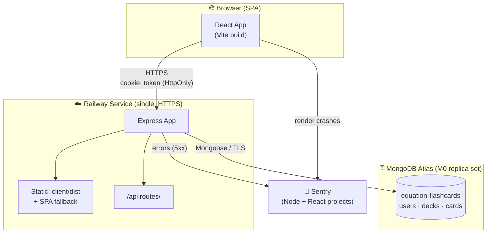

---

## 2. Monorepo Structure

npm workspaces with three packages. The `shared` package holds Zod schemas and
constants imported by **both** client and server, so validation rules are
identical on each side.

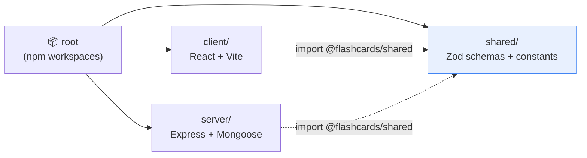

```
equation-flashcards/
├── client/        React SPA (Vite, Tailwind, Base UI, TanStack Query)
├── server/        Express API (Mongoose, Passport, Pino)
├── shared/        @flashcards/shared — Zod schemas + constants
├── docs/          SRS, API.md, Architecture.md
└── package.json   workspaces + root scripts (build, start, test)
```

---

## 3. Backend Layered Architecture

A strict layering convention: **routes → middleware → controllers → services
→ models**. Controllers are thin HTTP glue; **all business logic and ownership
checks live in services**. The one intentional exception is `login`, which uses
`passport.authenticate('local')` in the controller (Passport treated as HTTP
plumbing; the strategy itself delegates to the service).

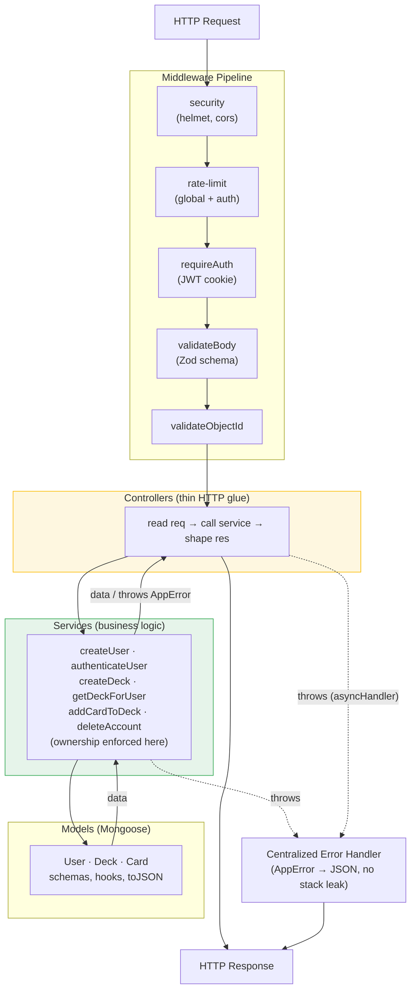

### Request lifecycle (full middleware order in `app.js`)

```mermaid
flowchart LR
    A["trust proxy"] --> B["security<br/>(helmet+cors)"]
    B --> C["json + cookie parser"]
    C --> D["passport.initialize"]
    D --> E["morgan (non-test)"]
    E --> F["globalLimiter /api"]
    F --> G["API routes<br/>/health /auth /decks /cards /account"]
    G --> H["/api 404 (JSON)"]
    H --> I["serveClient<br/>(prod: static + SPA fallback)"]
    I --> J["Sentry error handler<br/>(if DSN)"]
    J --> K["errorHandler (last)"]
```

---

## 4. Authentication Flow

JWT issued on signup/login, stored in an **HttpOnly, Secure, SameSite=Lax
cookie** named `token`. No `Authorization` header. Protected routes verify the
cookie via the `passport-jwt` strategy behind `requireAuth`.

### Signup / Login (sets cookie)

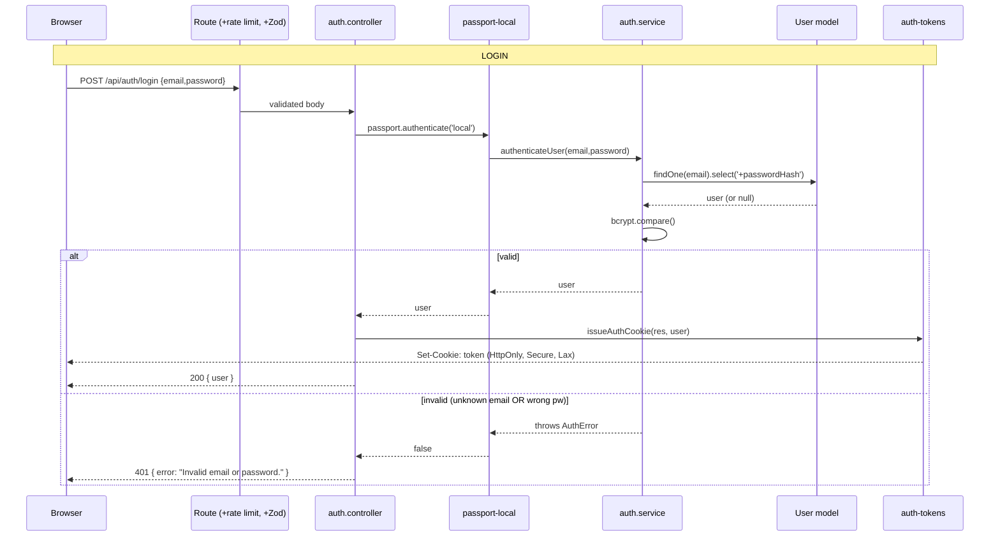

> Generic `401` for both unknown email and wrong password prevents user
> enumeration (single source of truth in `authenticateUser`).

### Accessing a protected route

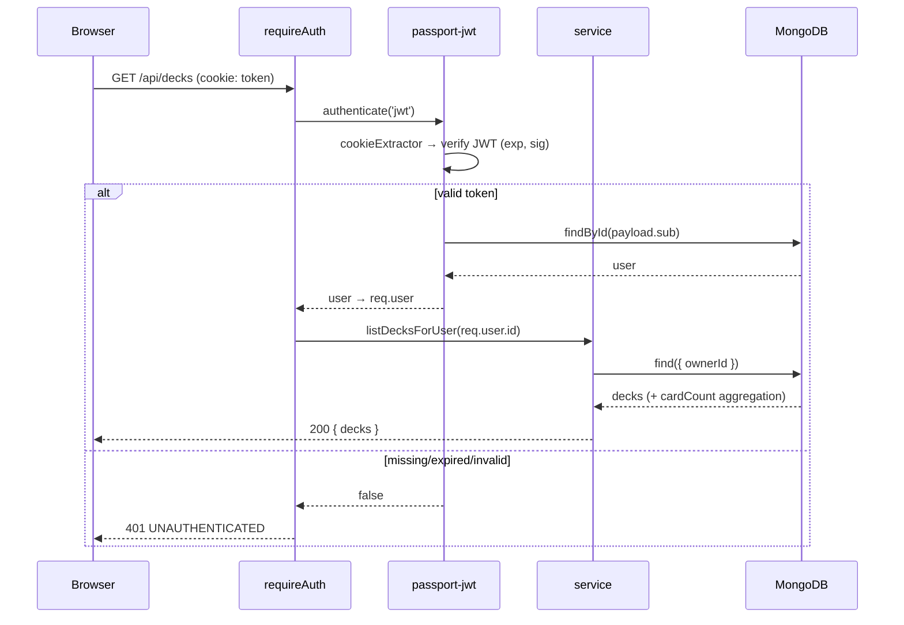

---

## 5. Data Model

Three collections. Ownership is hierarchical: a **Card** belongs to a **Deck**,
which belongs to a **User**. Cards have no direct `ownerId` — they are
authorized transitively through their parent deck.

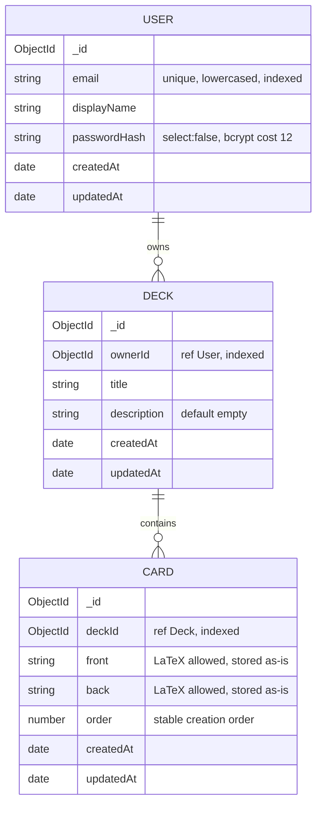

### Ownership & authorization (the chokepoint)

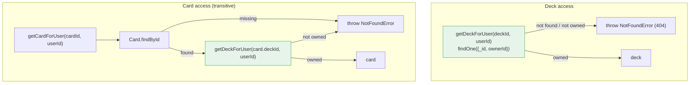

> Cross-user access always returns **404, not 403** — existence is never
> disclosed. All deck/card reads, updates, and deletes funnel through
> `getDeckForUser`, so authorization can't be bypassed by a thin controller.

### Cascade deletes (transactional)

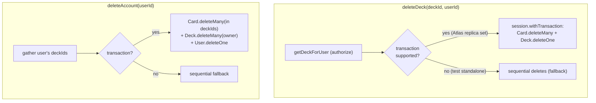

---

## 6. Frontend Architecture

Feature-based React SPA. **TanStack Query** owns server state (caching,
invalidation); **AuthContext** (sourced from the `/me` query) drives route
guards. UI primitives come from **Base UI** (note: the `render`-prop pattern,
not Radix's `asChild`). Forms use React Hook Form + the **shared Zod schemas**.

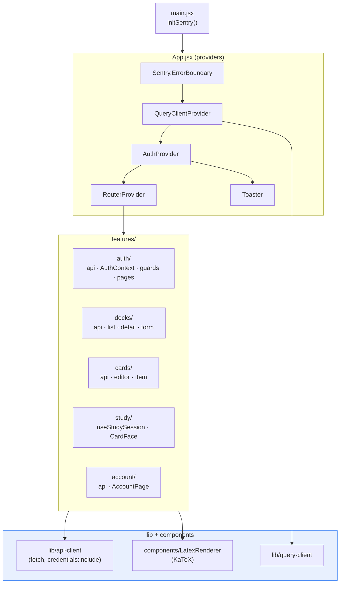

### Routing & guards

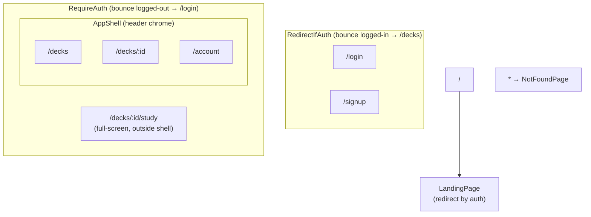

### Server-state flow (TanStack Query)

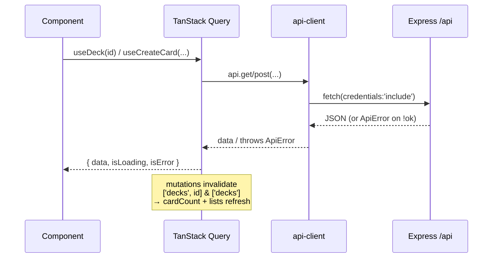

---

## 7. LaTeX Rendering Pipeline

The app's core purpose. Card faces mix plain text and LaTeX; the renderer
tokenizes `$...$` (inline) and `$$...$$` (block), runs KaTeX with
`throwOnError:false` and `trust:false`, and degrades gracefully on malformed
input. Plain text is React-escaped (XSS-safe); only KaTeX's own output uses
`dangerouslySetInnerHTML`.

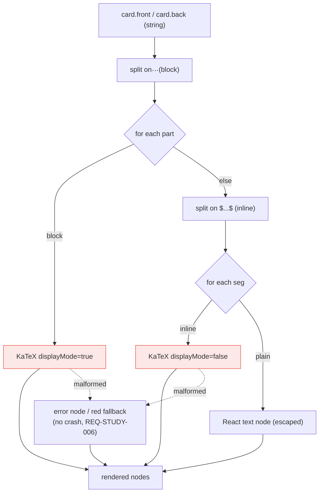

---

## 8. Study Mode State Machine

`useStudySession` manages a session over the deck's ordered cards: front-first,
flip to reveal, navigate (buttons / arrow keys / swipe), and a completion view.

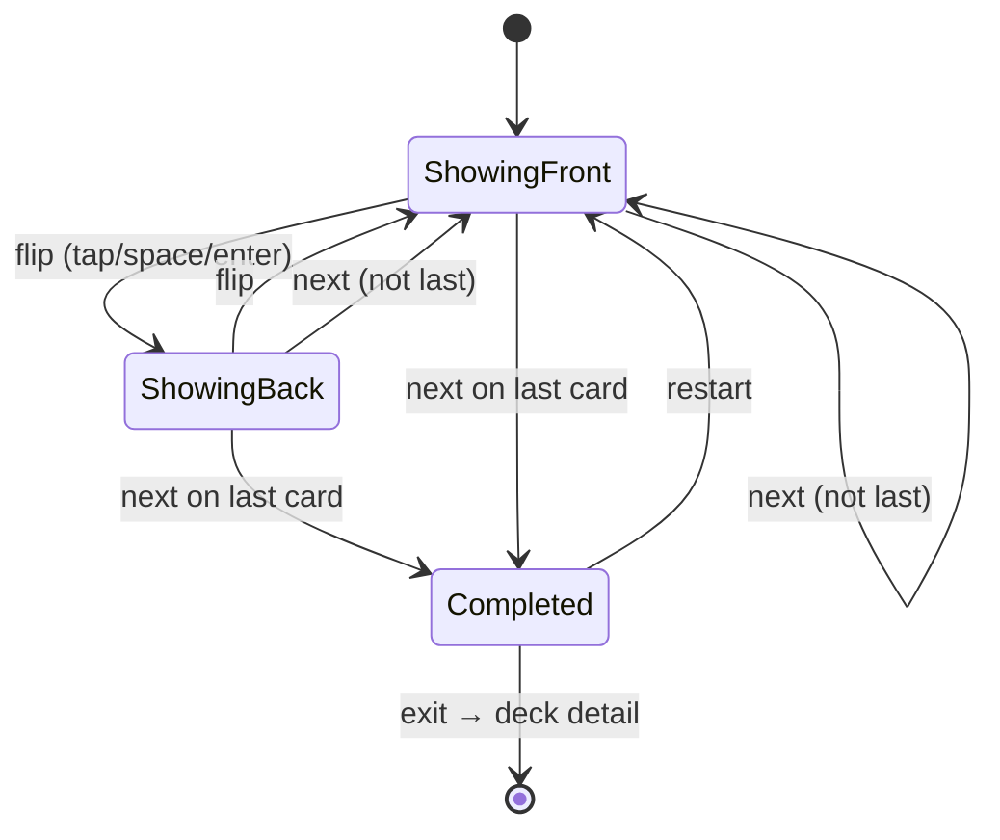

---

## 9. Deployment Topology

Single-service: one Railway container builds the client (`vite build`) and runs
Express, which serves `client/dist` + the API on one origin. Atlas (replica
set) enables real transactions for cascade deletes.

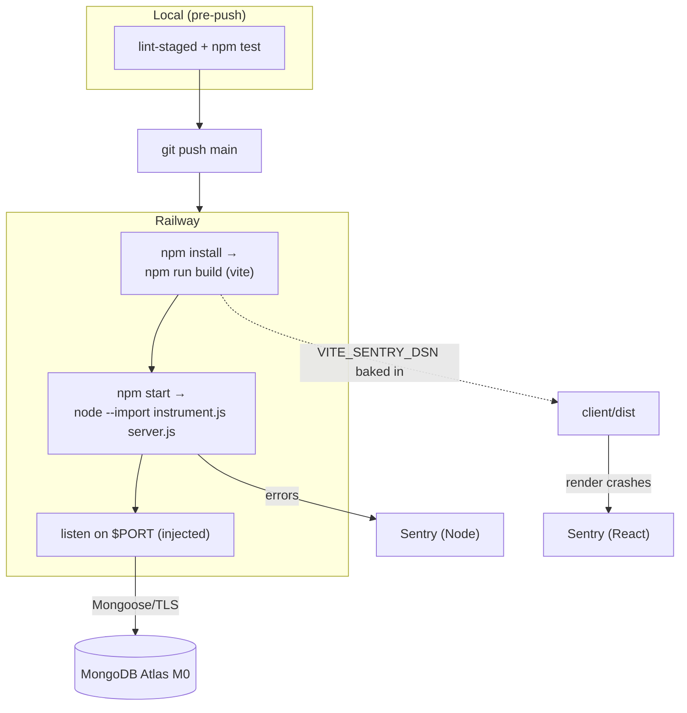

### Environment variables

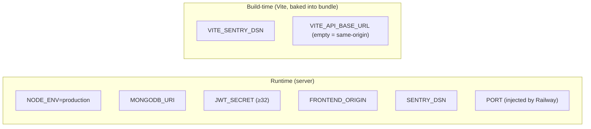

---

## 10. Cross-Cutting Concerns

| Concern              | Implementation                                                             |
| -------------------- | -------------------------------------------------------------------------- |
| **Validation**       | Shared Zod schemas (`@flashcards/shared`) — identical on client & server   |
| **AuthN**            | JWT in HttpOnly/Secure/SameSite=Lax cookie; bcrypt (cost 12)               |
| **AuthZ**            | Ownership enforced in services; `getDeckForUser` chokepoint; 404-not-403   |
| **Errors**           | `AppError` subclasses → centralized handler → uniform JSON, no stack leaks |
| **Rate limiting**    | Global (`/api`) + strict auth limiter (5/15min)                            |
| **Security headers** | helmet + CORS (`FRONTEND_ORIGIN` allowlist)                                |
| **Logging**          | Pino (JSON in prod), with secret redaction                                 |
| **Observability**    | Sentry (Node + React), `--import` preload for instrumentation              |
| **Atomicity**        | Transactions for cascade deletes (replica set), standalone fallback        |
| **Testing**          | Mocha + Supertest (server) · Vitest + RTL (client)                         |
