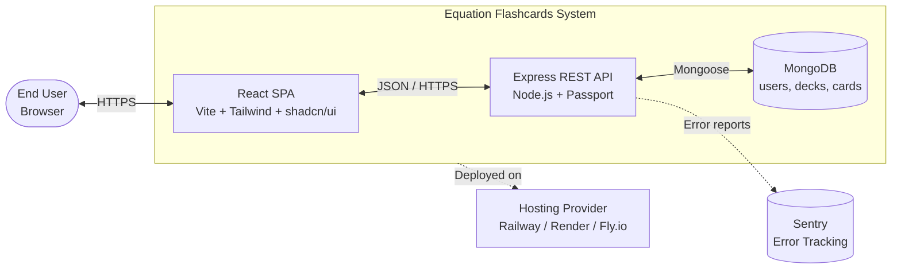
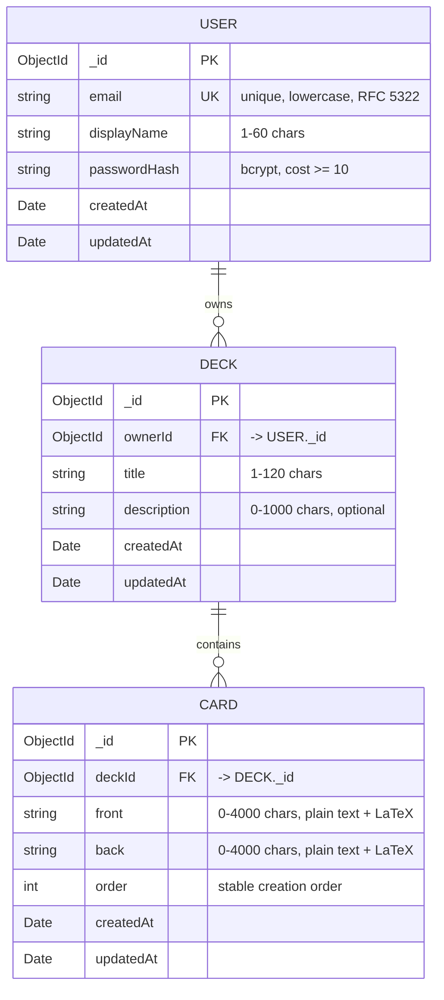
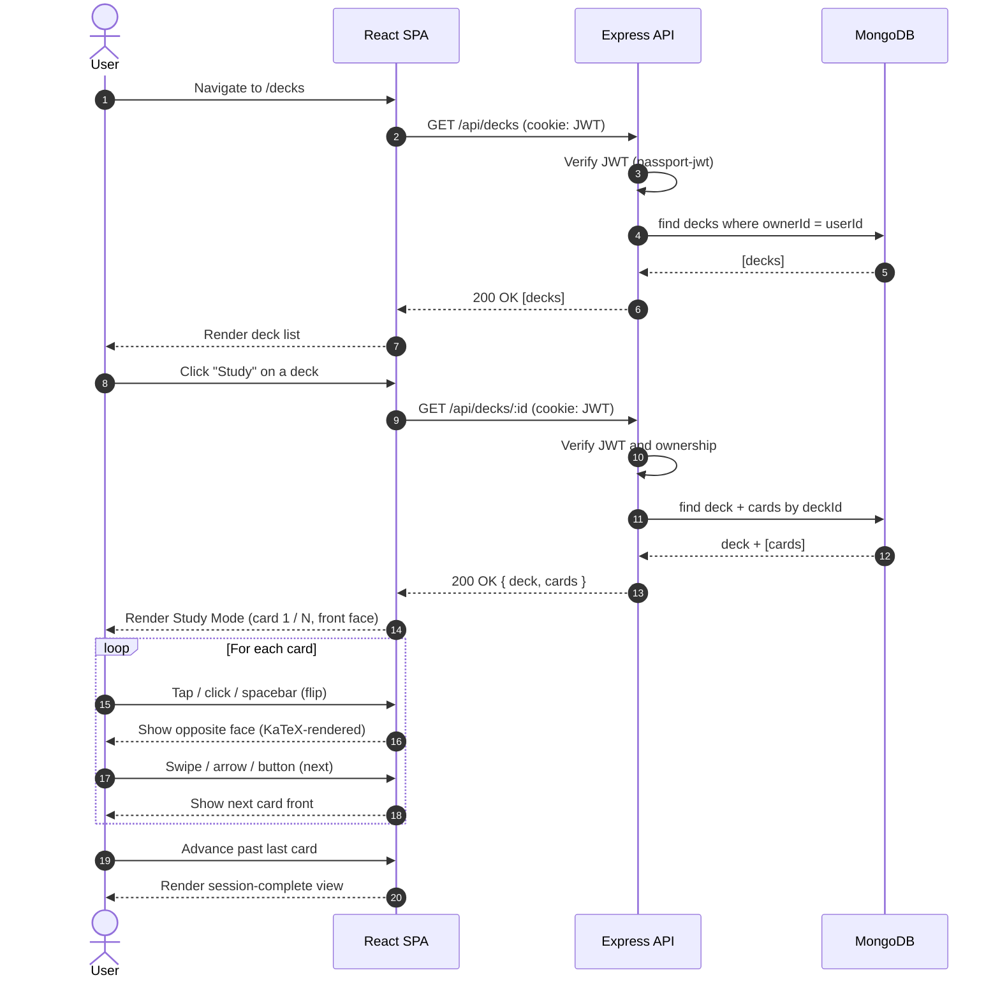
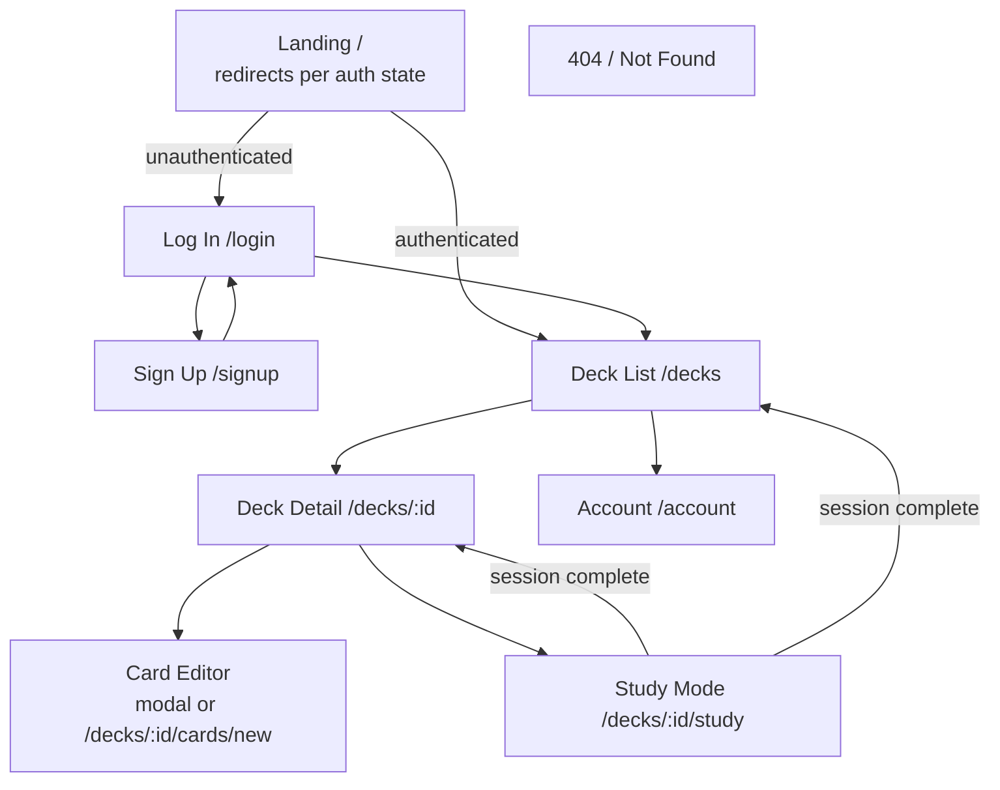

# Software Requirements Specification

## For Equation-Flashcards

Version 0.1  
Prepared by Felix Leitz
11 July 2026

## Table of Contents

<!-- TOC -->

- [1. Introduction](#1-introduction)
  - [1.1 Document Purpose](#11-document-purpose)
  - [1.2 Product Scope](#12-product-scope)
  - [1.3 Definitions, Acronyms, and Abbreviations](#13-definitions-acronyms-and-abbreviations)
  - [1.4 References](#14-references)
  - [1.5 Document Overview](#15-document-overview)
- [2. Product Overview](#2-product-overview)
  - [2.1 Product Perspective](#21-product-perspective)
  - [2.2 Product Functions](#22-product-functions)
  - [2.3 Product Constraints](#23-product-constraints)
  - [2.4 User Characteristics](#24-user-characteristics)
  - [2.5 Assumptions and Dependencies](#25-assumptions-and-dependencies)
  - [2.6 Apportioning of Requirements](#26-apportioning-of-requirements)
- [3. Requirements](#3-requirements)
  - [3.1 External Interfaces](#31-external-interfaces)
  - [3.2 Functional](#32-functional)
  - [3.3 Quality of Service](#33-quality-of-service)
  - [3.4 Compliance](#34-compliance)
  - [3.5 Design and Implementation](#35-design-and-implementation)
  - [3.6 AI/ML](#36-aiml)
- [4. Verification](#4-verification)
- [5. Appendixes](#5-appendixes)
<!-- TOC -->

## Revision History

| Name        | Date         | Reason For Changes | Version |
| ----------- | ------------ | ------------------ | ------- |
| Felix Leitz | 11 June 2026 | Inital Draft       | 0.1     |
|             |              |                    |         |

---

## 1. Introduction

This Software Requirements Specification (SRS) defines the requirements for **Equation-Flashcards**, a web application that lets users create, organize, and study flashcards containing mathematical equations rendered in LaTeX. The document specifies what the system must do, the constraints it must operate under, and the criteria by which it will be verified, all without prescribing implementation details. It is intended to guide development of the Minimum Viable Product (MVP) and serve as a reference for design, testing, and future iterations.

This chapter introduces the document itself: its purpose (§1.1), the product's scope (§1.2), terminology used throughout (§1.3), referenced materials (§1.4), and a guide to navigating the remaining sections (§1.5). Detailed product context, requirements, and verification methods are deferred to Sections 2, 3, and 4 respectively.

### 1.1 Document Purpose

The purpose of this SRS is to specify the functional and non-functional requirements of the Equation Flashcards application in sufficient detail to enable design, implementation, and verification of the MVP. It defines **what** the system must do — not how it will be built — so that scope, behavior, and quality expectations are unambiguous.

The primary audiences are:

- **The developer** (project author), who uses the SRS to plan, build, and self-verify the system.
- **Project supervisors, reviewers, or instructors**, who use it to evaluate scope, completeness, and engineering rigor.
- **Future contributors or maintainers** (including the author at a later date), who use it to understand original intent before extending or modifying the system.
- **Quality assurance**, fulfilled by the same author through automated and manual testing, who uses the SRS to derive verification cases.

The SRS is a living document: it will be revised as requirements evolve, with all changes captured in the Revision History.

### 1.2 Product Scope

**Equation Flashcards (v1.0 — MVP)** is a responsive web application that enables individual users to create personal collections (decks) of flashcards, where both the front and back of each card may include LaTeX-rendered mathematical equations. Users can study a deck by stepping through its cards one at a time, flipping between front and back. The product's purpose is to support self-directed learning of equation-heavy material — such as university-level mathematics, physics, and engineering courses — where conventional flashcard tools render formulas poorly or not at all.

**In scope for the MVP:**

- User account creation, authentication, and session management
- Creation, editing, and deletion of decks and flashcards
- LaTeX equation rendering on both card faces
- Sequential study mode through a chosen deck
- Full functionality on mobile and desktop browsers

**Out of scope for the MVP** (potential future work):

- Sharing decks between users or publishing public decks
- Spaced repetition algorithms or scheduling
- Progress tracking, statistics, or analytics
- Search, tagging, or categorization of decks
- AI-assisted card generation or import from external sources

The product is a self-contained web application; it does not integrate with external learning platforms in this release.

### 1.3 Definitions, Acronyms, and Abbreviations

| Term    | Definition                                                                                                                                       |
| ------- | ------------------------------------------------------------------------------------------------------------------------------------------------ |
| API     | Application Programming Interface — a set of definitions and protocols for building and integrating application software                         |
| Card    | A single flashcard consisting of a front face and a back face, each of which may contain text and/or LaTeX equations                             |
| CRUD    | Create, Read, Update, Delete — the four basic operations of persistent storage                                                                   |
| Deck    | A user-owned, named collection of one or more flashcards (also referred to as a "collection")                                                    |
| JWT     | JSON Web Token — a compact, URL-safe token format used for authenticating API requests                                                           |
| KaTeX   | A fast, open-source JavaScript library for rendering LaTeX mathematical notation in web browsers                                                 |
| LaTeX   | A typesetting system widely used for mathematical and scientific notation; in this product, used as the input format for equations on flashcards |
| MERN    | A web stack consisting of MongoDB, Express, React, and Node.js                                                                                   |
| MongoDB | A document-oriented NoSQL database, used as the system's primary data store                                                                      |
| MVP     | Minimum Viable Product — the smallest feature set that delivers value and validates the product concept                                          |
| SPA     | Single-Page Application — a web app that loads a single HTML page and updates content dynamically via JavaScript                                 |
| SRS     | Software Requirements Specification — a document that describes the intended purpose, requirements, and nature of a software system              |
| UI      | User Interface — the visual part of a computer application through which a user interacts with the software                                      |
| User    | An individual with a registered account who creates and studies their own flashcard decks                                                        |

### 1.4 References

| #   | Title                                                                                                        | Owner / Author    | Version | Date | Location                             | Type                               |
| --- | ------------------------------------------------------------------------------------------------------------ | ----------------- | ------- | ---- | ------------------------------------ | ---------------------------------- |
| R1  | IEEE/ISO/IEC 29148:2018 — Systems and software engineering — Life cycle processes — Requirements engineering | ISO/IEC/IEEE      | 2018    | 2018 | iso.org                              | Informative                        |
| R2  | KaTeX Documentation                                                                                          | KaTeX maintainers | latest  | —    | https://katex.org/docs/              | Normative (LaTeX subset supported) |
| R3  | OWASP Top 10 — Web Application Security Risks                                                                | OWASP Foundation  | 2021    | 2021 | https://owasp.org/Top10/             | Informative                        |
| R4  | Web Content Accessibility Guidelines (WCAG) 2.1                                                              | W3C               | 2.1     | 2018 | https://www.w3.org/TR/WCAG21/        | Informative                        |
| R5  | MongoDB Manual                                                                                               | MongoDB, Inc.     | 7.x     | —    | https://www.mongodb.com/docs/manual/ | Informative                        |
| R6  | Express.js Documentation                                                                                     | OpenJS Foundation | 4.x     | —    | https://expressjs.com/               | Informative                        |
| R7  | React Documentation                                                                                          | Meta Open Source  | 18.x+   | —    | https://react.dev/                   | Informative                        |

Additional references (e.g., a separate UI style guide or deployment runbook) may be added in later revisions.

### 1.5 Document Overview

The remainder of this SRS is organized as follows:

- **Section 2 — Product Overview** describes the product's context, major functions, constraints, target users, and assumptions, providing the background needed to interpret requirements.
- **Section 3 — Requirements** specifies the verifiable functional and non-functional requirements grouped by external interfaces, functional behavior, quality of service, compliance, and design/implementation constraints.
- **Section 4 — Verification** defines how each requirement will be confirmed, via testing, analysis, inspection, or demonstration.
- **Section 5 — Appendixes** contains supporting material such as diagrams or data dictionaries.

**Conventions used in this document:**

- The keywords _shall_, _should_, and _may_ follow IEEE 29148 conventions: _shall_ indicates a mandatory requirement, _should_ a recommended one, and _may_ an optional one.
- Each requirement carries a unique identifier of the form `REQ-[AREA]-[NNN]` and is immutable once published; revisions are tracked via version suffixes and the Revision History table above.
- Cross-references between sections use section numbers (e.g., "see §3.2") rather than page numbers.

## 2. Product Overview

This section provides background and context that shapes the requirements specified in §3. It situates Equation Flashcards within its broader environment (§2.1), summarizes the major capabilities the product provides (§2.2), identifies the constraints under which it must operate (§2.3), describes the intended users (§2.4), captures assumptions and external dependencies (§2.5), and apportions requirements across MVP and future increments (§2.6).

### 2.1 Product Perspective

**Equation Flashcards** is a new, self-contained web application developed as a first end-to-end fullstack project by an individual developer. It is not part of a product family, does not replace an existing system, and has no upstream or downstream system dependencies beyond standard web infrastructure (DNS, browser runtimes) and the third-party services it explicitly integrates with for hosting, persistence, and error reporting.

The product follows a conventional client-server architecture:

- A **React single-page application (SPA)** runs in the user's browser and provides all user interaction.
- An **Express REST API** running on Node.js handles authentication, business logic, and data access.
- A **MongoDB database** persists user accounts, decks, and flashcards.
- **KaTeX** (running client-side) renders LaTeX equations to HTML/CSS at display time.

Ownership and support are the responsibility of the project author. There are no formal Service Level Agreements (SLAs) for the MVP; the system is expected to be best-effort for personal and portfolio use. A high-level context diagram is provided in §5 (Appendixes) and may be added in a future revision.

### 2.2 Product Functions

At a high level, Equation Flashcards enables users to:

- **Manage an account** — sign up, log in, and log out using email and password credentials.
- **Create decks** — create named collections to organize related flashcards.
- **Create flashcards** — add cards to a deck, with text and optional LaTeX equations on both the front and back faces.
- **Edit content** — modify existing decks and flashcards after creation.
- **Delete content** — remove decks (and their cards) or individual cards, with explicit confirmation for destructive actions.
- **Browse decks** — view a list of decks owned by the current user.
- **Study a deck** — step sequentially through the cards in a deck, flipping between front and back.
- **Render equations** — see LaTeX expressions correctly typeset on every card face that contains them.
- **Use the application on mobile** — access full functionality on small touchscreens as well as desktop browsers.

Detailed behaviors, inputs, outputs, and edge cases for these functions are specified in §3.2 (Functional Requirements).

### 2.3 Product Constraints

The following constraints shape the design and implementation of the product. They are stated here as binding contextual conditions; the verifiable requirements that satisfy them appear in §3.

**Technology constraints:**

- The system **must** be implemented on the MERN stack: MongoDB (database), Express (server framework), React (frontend framework), and Node.js (runtime).
- The frontend **must** be built with Vite and styled using Tailwind CSS and shadcn/ui components.
- LaTeX rendering **must** be performed client-side using KaTeX (via `react-katex`).
- Authentication **must** be implemented using Passport.js with the local and JWT strategies, with passwords hashed using bcryptjs.
- Request and response payload validation **must** use Zod schemas, applied on both client and server.

**Platform constraints:**

- The application **must** function on current versions (latest two major releases as of June 2026) of Chromium-based browsers (Chrome, Edge), Firefox, and Safari, on both desktop and mobile.
- The application **must** be a responsive web app; native mobile apps are out of scope.

**Operational constraints:**

- All user data **must** be transmitted over HTTPS in any deployed environment.
- The deployed system **must** operate within the resource limits of free or low-cost hosting tiers (e.g., MongoDB Atlas free tier of 512 MB).

**Project constraints:**

- The MVP is developed by a **single developer** with limited time, which constrains scope (see §2.6) and complexity of features.
- The project has **no budget for paid third-party APIs** beyond minimal hosting costs; all dependencies must be free, open-source, or have a viable free tier.

**Preferred (non-binding) constraints:**

- The system _should_ be deployable to a single hosting provider where practical, to simplify operations.
- The codebase _should_ follow ESLint and Prettier configurations enforced via pre-commit hooks.

### 2.4 User Characteristics

The MVP targets a single user class:

**End User (Student / Self-Learner)**

- **Description:** An individual studying equation-heavy material — typically university-level mathematics, physics, engineering, or related disciplines — who wants a personal, mobile-friendly tool for active recall practice.
- **Domain expertise:** Comfortable with mathematical notation; familiar with LaTeX syntax for entering equations (or willing to learn the basics, since most users in the target domain already have some exposure).
- **Technical expertise:** General consumer-level web literacy. No development or system administration knowledge required.
- **Frequency of use:** Variable; expected pattern is bursts of intense use during study periods (e.g., before exams), with quieter periods between.
- **Access level:** Authenticated users have full read/write access to their own decks and cards only. There are no administrative, moderator, or guest roles in the MVP.
- **Devices:** Mix of desktop/laptop (more common for deck creation) and mobile phone (more common for studying on the go).
- **Accessibility considerations:** The interface should follow WCAG 2.1 Level AA guidelines as a baseline (see §3.1.1 and §3.4). Specific accommodations such as screen-reader optimization beyond reasonable defaults are not in scope for the MVP.
- **Localization:** English (US) only for the MVP; LaTeX content itself is language-neutral.

The MVP does not differentiate between roles such as instructor, student, or administrator — every authenticated user has the same capabilities, scoped to their own data.

### 2.5 Assumptions and Dependencies

The following assumptions and dependencies are recorded so their failure modes are explicit. If any prove false, the affected requirements may need revision.

**Assumptions:**

| #   | Assumption                                                                                                                                    | Impact if False                                                                         |
| --- | --------------------------------------------------------------------------------------------------------------------------------------------- | --------------------------------------------------------------------------------------- |
| A1  | Users have stable internet connectivity during use.                                                                                           | Offline study mode would become a requirement; current design assumes online operation. |
| A2  | Users' browsers support modern JavaScript (ES2020+) and CSS (Grid, Flexbox, custom properties).                                               | Significant rework of frontend toolchain and polyfills required.                        |
| A3  | Users are willing and able to enter equations as LaTeX source (or use a small visual helper if provided).                                     | A WYSIWYG equation editor would need to be added, increasing scope substantially.       |
| A4  | The free tiers of chosen hosting providers (database, app hosting, error tracking) remain available and adequate for portfolio-scale traffic. | Migration to paid tiers or alternative providers required; budget impact.               |
| A5  | A single developer can complete the MVP within roughly 6–8 weeks of part-time work.                                                           | Scope reduction (§2.6) or timeline extension required.                                  |

**Dependencies:**

| #   | Dependency                                                  | Type     | Impact if Unavailable                                                                       |
| --- | ----------------------------------------------------------- | -------- | ------------------------------------------------------------------------------------------- |
| D1  | Node.js (LTS) runtime                                       | Tooling  | Blocks backend execution; no straightforward substitute within the chosen stack.            |
| D2  | MongoDB (self-hosted or via MongoDB Atlas)                  | Service  | Blocks all persistence; data layer must be re-implemented if replaced.                      |
| D3  | KaTeX library                                               | Library  | Equations would render as plaintext or require fallback to MathJax.                         |
| D4  | Passport.js (`passport-local`, `passport-jwt`) and bcryptjs | Library  | Authentication would need to be re-implemented; security review required.                   |
| D5  | Hosting provider (e.g., Railway, Render, or Fly.io)         | Service  | Deployment must be migrated to an alternative provider.                                     |
| D6  | Sentry (error tracking)                                     | Service  | Production observability degraded; non-blocking for functionality.                          |
| D7  | Modern browser engines (Chromium, Gecko, WebKit)            | Platform | UI would degrade for users on legacy browsers; explicit non-support is acceptable per §2.3. |

A formal risk register is not maintained for the MVP; this table serves as the lightweight equivalent.

### 2.6 Apportioning of Requirements

The product is delivered in increments. The MVP (v1.0) focuses on the smallest feature set that demonstrates the full study loop end-to-end; later releases add capabilities that make the product collaborative and adaptive.

**Increment plan:**

| Increment                 | Focus                                                                                                                                            | Status              |
| ------------------------- | ------------------------------------------------------------------------------------------------------------------------------------------------ | ------------------- |
| **v1.0 — MVP**            | Account management; deck and card CRUD; LaTeX rendering; sequential study; mobile responsiveness.                                                | In scope — this SRS |
| **v1.1 — Polish**         | Search and filtering of own decks; keyboard shortcuts; UI/accessibility refinements; basic analytics for the developer (deck count, card count). | Deferred            |
| **v2.0 — Sharing**        | Public deck sharing via shareable links; deck duplication; user profiles.                                                                        | Deferred            |
| **v2.x — Adaptive Study** | Spaced repetition (e.g., FSRS algorithm); per-card review history; due-card scheduling.                                                          | Deferred            |
| **v3.x — Import / AI**    | Import from CSV/Anki packages; AI-assisted card generation from notes or PDFs.                                                                   | Speculative         |

**MVP-to-component allocation (high-level):**

| Functional area    | Frontend (React SPA)                                  | Backend (Express API)                                                | Database (MongoDB)        |
| ------------------ | ----------------------------------------------------- | -------------------------------------------------------------------- | ------------------------- |
| Account management | Sign-up / login forms; auth state management          | `/api/auth/*` endpoints; Passport strategies; JWT issuance           | `users` collection        |
| Deck management    | Deck list, create/edit/delete UI                      | `/api/decks/*` endpoints; ownership checks                           | `decks` collection        |
| Card management    | Card editor with LaTeX preview; create/edit/delete UI | `/api/decks/:id/cards`, `/api/cards/:id` endpoints; ownership checks | `cards` collection        |
| Study mode         | Sequential card viewer with flip interaction          | `GET /api/decks/:id` (returns deck + cards)                          | `cards` collection (read) |
| Equation rendering | KaTeX rendering on card display and editor preview    | None (rendering is fully client-side)                                | None                      |
| Responsive UX      | Tailwind / shadcn responsive layouts                  | None                                                                 | None                      |

Detailed requirement-to-component traceability will be maintained inline with each requirement in §3 (via the **More Information** field of the requirement template) once requirements are written. Deferred requirements (v1.1+) are not specified in this revision of the SRS and will be added when those increments are planned.

## 3. Requirements

This section specifies the verifiable obligations of the Equation Flashcards system. Each requirement is assigned a unique identifier of the form `REQ-[AREA]-[NNN]` and is stated using IEEE 29148 conventions: _shall_ indicates a binding obligation, _should_ a strong recommendation, and _may_ an option. Requirements are grouped into external interfaces (§3.1), functional behavior (§3.2), quality of service (§3.3), compliance (§3.4), and design/implementation constraints (§3.5). Section §3.6 (AI/ML) is not applicable to the MVP and is included only for template completeness.

### 3.1 External Interfaces

This subsection specifies how the system interacts with users, other software, and (where relevant) hardware and communication channels. The MVP's external interfaces are limited to user interfaces, internal client–server APIs, and standard web protocols.

#### 3.1.1 User Interfaces

| ID             | Requirement                                                                                                                                                           |
| -------------- | --------------------------------------------------------------------------------------------------------------------------------------------------------------------- |
| **REQ-UI-001** | The system _shall_ provide a web-based user interface accessible via the latest two major versions of Chrome, Edge, Firefox, and Safari (desktop and mobile).         |
| **REQ-UI-002** | The user interface _shall_ be fully responsive and operable on viewports from 320 px to at least 1920 px wide without horizontal scrolling.                           |
| **REQ-UI-003** | All interactive elements _shall_ have minimum touch-target dimensions of 44 × 44 CSS pixels on touch devices.                                                         |
| **REQ-UI-004** | The interface _shall_ present the following primary screens: Sign Up, Log In, Deck List, Deck Detail (with cards), Card Editor, Study Mode, and a 404/Not Found view. |
| **REQ-UI-005** | LaTeX equations on flashcards _shall_ be rendered visually using KaTeX wherever the equation appears (study mode, card list, editor preview).                         |
| **REQ-UI-006** | The card editor _shall_ provide a live preview of the rendered LaTeX as the user types.                                                                               |
| **REQ-UI-007** | Destructive actions (delete deck, delete card) _shall_ require explicit user confirmation via a modal dialog before being executed.                                   |
| **REQ-UI-008** | The interface _should_ meet WCAG 2.1 Level AA contrast requirements (4.5:1 for normal text, 3:1 for large text).                                                      |
| **REQ-UI-009** | All form fields _shall_ display inline validation messages on submission failure, indicating which fields are invalid and why.                                        |
| **REQ-UI-010** | Loading states _shall_ be visible to the user for any operation that takes longer than 300 ms.                                                                        |
| **REQ-UI-011** | The system _shall_ display non-blocking toast notifications for transient outcomes (e.g., "Deck saved", "Card deleted", "Login failed").                              |
| **REQ-UI-012** | The interface _shall_ be presented in English (US) for the MVP.                                                                                                       |

#### 3.1.2 Hardware Interfaces

| ID             | Requirement                                                                                                                           |
| -------------- | ------------------------------------------------------------------------------------------------------------------------------------- |
| **REQ-HW-001** | The system _shall_ not require any hardware interface beyond a standard input device (keyboard, mouse, or touchscreen) and a display. |

#### 3.1.3 Software Interfaces

| ID             | Requirement                                                                                                                                              |
| -------------- | -------------------------------------------------------------------------------------------------------------------------------------------------------- |
| **REQ-SI-001** | The Express backend _shall_ expose a JSON-over-HTTP REST API consumed by the React frontend.                                                             |
| **REQ-SI-002** | All API request and response bodies _shall_ use the `application/json` media type, encoded as UTF-8.                                                     |
| **REQ-SI-003** | The backend _shall_ connect to a MongoDB database (version 6.0 or later) using the official Mongoose ODM.                                                |
| **REQ-SI-004** | The frontend _shall_ render LaTeX equations using KaTeX (latest stable release) via the `react-katex` wrapper.                                           |
| **REQ-SI-005** | The backend _shall_ report unhandled errors to Sentry in production environments, with personally identifiable information scrubbed from error payloads. |
| **REQ-SI-006** | The system _shall not_ depend on any external API for core functionality (account, deck, card, or study operations) in the MVP.                          |

#### 3.1.4 Communications Interfaces

| ID             | Requirement                                                                                                                                                                               |
| -------------- | ----------------------------------------------------------------------------------------------------------------------------------------------------------------------------------------- |
| **REQ-CI-001** | All client–server communication in any deployed environment _shall_ occur over HTTPS (TLS 1.2 or later).                                                                                  |
| **REQ-CI-002** | The API _shall_ enforce CORS, allowing requests only from the configured frontend origin(s).                                                                                              |
| **REQ-CI-003** | Authentication credentials (JWTs) _shall_ be transmitted via HTTP-only, `Secure`, `SameSite=Lax` cookies.                                                                                 |
| **REQ-CI-004** | API responses _shall_ include security headers consistent with `helmet`'s default configuration (including HSTS, X-Content-Type-Options, X-Frame-Options, and a Content Security Policy). |

---

### 3.2 Functional

Functional requirements are grouped by feature area. Each requirement specifies a verifiable behavior. Authorization requirements (e.g., "users may only access their own data") are stated once per area rather than repeated for every endpoint.

#### 3.2.1 Account Management

| ID              | Requirement                                                                                                                                                                        |
| --------------- | ---------------------------------------------------------------------------------------------------------------------------------------------------------------------------------- |
| **REQ-ACC-001** | The system _shall_ allow a visitor to create an account by providing a unique email address, a password, and a display name.                                                       |
| **REQ-ACC-002** | The system _shall_ validate that the email address conforms to RFC 5322 syntax and is not already registered.                                                                      |
| **REQ-ACC-003** | The system _shall_ require passwords to be at least 8 characters long and to contain at least one letter and one digit.                                                            |
| **REQ-ACC-004** | The system _shall_ hash passwords using bcrypt (cost factor ≥ 10) before persisting them, and _shall not_ store passwords in plaintext or in a reversibly encrypted form.          |
| **REQ-ACC-005** | The system _shall_ allow a registered user to log in by providing their email and password.                                                                                        |
| **REQ-ACC-006** | On successful login, the system _shall_ issue a signed JWT and deliver it to the client via an HTTP-only cookie (per §3.1.4).                                                      |
| **REQ-ACC-007** | The system _shall_ allow an authenticated user to log out, which _shall_ invalidate the current session by clearing the authentication cookie.                                     |
| **REQ-ACC-008** | The system _shall_ return a generic authentication-failure message that does not disclose whether the email or the password was incorrect.                                         |
| **REQ-ACC-009** | After 5 consecutive failed login attempts from the same IP address within a 15-minute window, the system _shall_ rate-limit further attempts from that IP for at least 15 minutes. |
| **REQ-ACC-010** | A JWT issued by the system _shall_ expire no later than 7 days after issuance.                                                                                                     |

#### 3.2.2 Authorization

| ID               | Requirement                                                                                                                                                                                       |
| ---------------- | ------------------------------------------------------------------------------------------------------------------------------------------------------------------------------------------------- |
| **REQ-AUTH-001** | All endpoints except sign-up, login, and health-check _shall_ require a valid authentication token; requests without one _shall_ receive an HTTP 401 response.                                    |
| **REQ-AUTH-002** | A user _shall_ be able to read, modify, and delete only the decks and cards they own; access attempts to resources owned by another user _shall_ return HTTP 404 (to avoid disclosing existence). |
| **REQ-AUTH-003** | The system _shall_ enforce ownership checks server-side; the client _shall not_ be trusted to enforce authorization.                                                                              |

#### 3.2.3 Deck Management

| ID               | Requirement                                                                                                                                              |
| ---------------- | -------------------------------------------------------------------------------------------------------------------------------------------------------- |
| **REQ-DECK-001** | The system _shall_ allow an authenticated user to create a deck by providing a title (1–120 characters) and an optional description (≤ 1000 characters). |
| **REQ-DECK-002** | The system _shall_ allow a user to retrieve a list of all decks they own, sorted by most-recently-updated by default.                                    |
| **REQ-DECK-003** | The system _shall_ allow a user to retrieve a single deck they own, including its cards.                                                                 |
| **REQ-DECK-004** | The system _shall_ allow a user to update the title and description of a deck they own.                                                                  |
| **REQ-DECK-005** | The system _shall_ allow a user to delete a deck they own; deletion _shall_ cascade to remove all cards belonging to that deck.                          |
| **REQ-DECK-006** | A user _shall_ be permitted to own up to 500 decks; attempts to exceed this limit _shall_ be rejected with a clear error message.                        |
| **REQ-DECK-007** | Deck titles _shall not_ be required to be unique within a user's account.                                                                                |

#### 3.2.4 Card Management

| ID               | Requirement                                                                                                                                                                      |
| ---------------- | -------------------------------------------------------------------------------------------------------------------------------------------------------------------------------- |
| **REQ-CARD-001** | The system _shall_ allow a user to add a card to a deck they own by providing front content and back content.                                                                    |
| **REQ-CARD-002** | Each card face (front and back) _shall_ accept content up to 4000 characters, comprising plain text and/or LaTeX expressions delimited by `$...$` (inline) or `$$...$$` (block). |
| **REQ-CARD-003** | The system _shall_ allow a user to update the front and/or back content of any card belonging to a deck they own.                                                                |
| **REQ-CARD-004** | The system _shall_ allow a user to delete any card belonging to a deck they own.                                                                                                 |
| **REQ-CARD-005** | The system _shall_ preserve the order in which cards are created within a deck and _shall_ present cards in that order by default.                                               |
| **REQ-CARD-006** | A deck _shall_ be permitted to contain up to 1000 cards; attempts to exceed this limit _shall_ be rejected with a clear error message.                                           |
| **REQ-CARD-007** | The system _shall_ persist invalid LaTeX as entered by the user; rendering errors _shall_ be handled at display time per REQ-STUDY-006.                                          |

#### 3.2.5 Study Mode

| ID                | Requirement                                                                                                                                                                                                                             |
| ----------------- | --------------------------------------------------------------------------------------------------------------------------------------------------------------------------------------------------------------------------------------- |
| **REQ-STUDY-001** | The system _shall_ allow a user to enter study mode for any deck they own that contains at least one card.                                                                                                                              |
| **REQ-STUDY-002** | In study mode, the system _shall_ display one card at a time, beginning with the first card of the deck.                                                                                                                                |
| **REQ-STUDY-003** | In study mode, the system _shall_ initially display the front face of the current card.                                                                                                                                                 |
| **REQ-STUDY-004** | The user _shall_ be able to flip the current card to reveal its opposite face via a click, tap, or keyboard interaction (e.g., spacebar).                                                                                               |
| **REQ-STUDY-005** | The user _shall_ be able to navigate to the next and previous cards via buttons, swipe gestures (mobile), or keyboard arrow keys.                                                                                                       |
| **REQ-STUDY-006** | If a card contains malformed LaTeX, the system _shall_ render the surrounding text and display the malformed expression as plain text with a visible indicator (e.g., a warning icon and tooltip), rather than failing the entire view. |
| **REQ-STUDY-007** | When the user advances past the last card, the system _shall_ display a session-complete view with options to restart the deck or return to the deck list.                                                                              |
| **REQ-STUDY-008** | The system _shall_ display the user's position within the deck (e.g., "Card 3 of 12") at all times during study mode.                                                                                                                   |
| **REQ-STUDY-009** | The MVP _shall not_ persist study progress between sessions; closing study mode and returning _shall_ restart from the first card.                                                                                                      |

#### 3.2.6 Input Validation

| ID              | Requirement                                                                                                                                                                                                                   |
| --------------- | ----------------------------------------------------------------------------------------------------------------------------------------------------------------------------------------------------------------------------- |
| **REQ-VAL-001** | All API endpoints _shall_ validate request bodies against Zod schemas; invalid requests _shall_ receive an HTTP 400 response containing a structured list of validation errors.                                               |
| **REQ-VAL-002** | The frontend _shall_ validate user-supplied form input using the same Zod schemas as the backend, where practical, to provide immediate feedback.                                                                             |
| **REQ-VAL-003** | The system _shall_ sanitize or escape all user-supplied text before rendering it in the DOM, to prevent injection of executable HTML or scripts. (KaTeX is treated as a trusted renderer for LaTeX content per REQ-COMP-004.) |

---

### 3.3 Quality of Service

Quality of service requirements specify how well the system performs its functions. Numeric thresholds reflect targets appropriate for an MVP on free-tier hosting; they are achievable but not luxurious.

#### 3.3.1 Performance

| ID               | Requirement                                                                                                                                                                                           |
| ---------------- | ----------------------------------------------------------------------------------------------------------------------------------------------------------------------------------------------------- |
| **REQ-PERF-001** | API endpoints serving CRUD operations on decks and cards _shall_ respond within 500 ms at the 95th percentile, measured server-side excluding cold starts, under a load of up to 10 concurrent users. |
| **REQ-PERF-002** | The initial frontend page load (Time to Interactive) _should_ be under 3 seconds on a typical 4G mobile connection (≈ 9 Mbps, 170 ms RTT).                                                            |
| **REQ-PERF-003** | Transitions between cards in study mode _shall_ complete within 100 ms on devices manufactured in 2022 or later.                                                                                      |
| **REQ-PERF-004** | The frontend production bundle (initial JavaScript download, gzipped) _should_ be no larger than 300 KB excluding KaTeX assets, and no larger than 500 KB including KaTeX.                            |

#### 3.3.2 Security

| ID              | Requirement                                                                                                                                                                                                |
| --------------- | ---------------------------------------------------------------------------------------------------------------------------------------------------------------------------------------------------------- |
| **REQ-SEC-001** | The system _shall_ enforce HTTPS for all client–server traffic in any deployed environment (cf. REQ-CI-001).                                                                                               |
| **REQ-SEC-002** | The system _shall_ apply the protections enumerated in REQ-CI-003 and REQ-CI-004 (HTTP-only cookies, security headers via helmet).                                                                         |
| **REQ-SEC-003** | The system _shall_ apply rate limiting to authentication endpoints (cf. REQ-ACC-009) and _should_ apply a more permissive global rate limit (e.g., 100 requests per minute per IP) to all other endpoints. |
| **REQ-SEC-004** | Secrets (database connection strings, JWT signing key, Sentry DSN) _shall_ be supplied via environment variables and _shall not_ be committed to source control.                                           |
| **REQ-SEC-005** | The JWT signing key _shall_ be at least 256 bits of entropy, generated from a cryptographically secure random source.                                                                                      |
| **REQ-SEC-006** | Dependencies _shall_ be audited for known vulnerabilities (e.g., via `npm audit`) before each release; high-severity advisories _shall_ be addressed prior to deployment.                                  |
| **REQ-SEC-007** | The system _shall not_ log passwords, JWTs, or full email addresses in application logs.                                                                                                                   |

#### 3.3.3 Reliability and Availability

| ID              | Requirement                                                                                                                                                                                                          |
| --------------- | -------------------------------------------------------------------------------------------------------------------------------------------------------------------------------------------------------------------- |
| **REQ-REL-001** | The system _should_ achieve at least 99% availability per calendar month, measured by uptime of the production frontend and API, excluding scheduled maintenance and outages caused by upstream free-tier providers. |
| **REQ-REL-002** | The system _shall_ return a meaningful error response (HTTP 5xx with a JSON error body) rather than exposing stack traces or unhandled exceptions to the client.                                                     |
| **REQ-REL-003** | A failure of a single API request _shall not_ leave persisted data in an inconsistent state; multi-step operations (e.g., deleting a deck and its cards) _shall_ be implemented atomically.                          |
| **REQ-REL-004** | No formal Recovery Time Objective (RTO) or Recovery Point Objective (RPO) is defined for the MVP; the database provider's default backup and restore capabilities are accepted.                                      |

#### 3.3.4 Maintainability

| ID                | Requirement                                                                                                                                                            |
| ----------------- | ---------------------------------------------------------------------------------------------------------------------------------------------------------------------- |
| **REQ-MAINT-001** | All source code _shall_ be stored in a Git repository with descriptive commit messages.                                                                                |
| **REQ-MAINT-002** | The codebase _shall_ pass ESLint and Prettier checks with the project's configured rules before merge to the main branch.                                              |
| **REQ-MAINT-003** | The project _shall_ include a README that documents how to install dependencies, configure environment variables, run the application locally, and run the test suite. |
| **REQ-MAINT-004** | Critical user flows (sign-up, login, deck CRUD, card CRUD, study mode entry) _shall_ be covered by automated tests (cf. §4).                                           |

#### 3.3.5 Usability

| ID              | Requirement                                                                                                                                                                                |
| --------------- | ------------------------------------------------------------------------------------------------------------------------------------------------------------------------------------------ |
| **REQ-USE-001** | A new user _shall_ be able to sign up, create their first deck, add a card containing a LaTeX equation, and begin studying it within 3 minutes, without consulting external documentation. |
| **REQ-USE-002** | Error messages presented to the user _shall_ be written in plain language and _shall_ indicate, where possible, what action the user can take to resolve the error.                        |
| **REQ-USE-003** | The application _shall_ preserve unsaved card-editor input across accidental navigation events (e.g., warn before leaving with unsaved changes).                                           |

---

### 3.4 Compliance

The MVP is a personal/portfolio project with no regulated data processing (no payments, no health data, no minors targeted), so formal compliance obligations are limited. The requirements below capture the baseline obligations the system commits to nonetheless.

| ID               | Requirement                                                                                                                                                                                                                         |
| ---------------- | ----------------------------------------------------------------------------------------------------------------------------------------------------------------------------------------------------------------------------------- |
| **REQ-COMP-001** | The system _shall_ collect from users only the data needed to provide its functions: email, display name, password (hashed), and the deck/card content the user creates.                                                            |
| **REQ-COMP-002** | The system _shall_ provide a means for a user to delete their account, which _shall_ cascade-delete all of their decks and cards within 30 days.                                                                                    |
| **REQ-COMP-003** | The system _should_ publish a brief privacy notice describing what data is collected, how it is used, and how users can delete their data.                                                                                          |
| **REQ-COMP-004** | The system _shall_ render LaTeX content via KaTeX, which is treated as a trusted renderer; KaTeX's `trust: false` setting (or equivalent) _shall_ be retained to prevent rendering of arbitrary HTML/JS embedded in LaTeX commands. |
| **REQ-COMP-005** | The system _should_ conform to WCAG 2.1 Level AA where reasonably achievable; known gaps _shall_ be documented.                                                                                                                     |
| **REQ-COMP-006** | All third-party libraries used _shall_ be distributed under licenses compatible with the project's intended use (MIT, Apache 2.0, BSD, ISC, or similar permissive licenses).                                                        |

---

### 3.5 Design and Implementation

These requirements bind specific aspects of the implementation, as anticipated by §2.3 (Product Constraints). They are stated here to make verification straightforward.

#### 3.5.1 Installation and Distribution

| ID               | Requirement                                                                                                                                                                                         |
| ---------------- | --------------------------------------------------------------------------------------------------------------------------------------------------------------------------------------------------- |
| **REQ-IMPL-001** | The system _shall_ be deployable to a single hosting platform (e.g., Railway, Render, or Fly.io) using a documented deployment process.                                                             |
| **REQ-IMPL-002** | The system _shall_ be configurable via environment variables for at least the following: database connection string, JWT signing key, frontend origin (for CORS), Sentry DSN, and Node environment. |

#### 3.5.2 Stack and Libraries

| ID               | Requirement                                                                                                                                                  |
| ---------------- | ------------------------------------------------------------------------------------------------------------------------------------------------------------ |
| **REQ-IMPL-003** | The backend _shall_ be implemented using Node.js (LTS), Express, and Mongoose against MongoDB.                                                               |
| **REQ-IMPL-004** | The frontend _shall_ be implemented using React (≥ 18) bundled with Vite, styled with Tailwind CSS, and composed using shadcn/ui components where practical. |
| **REQ-IMPL-005** | Authentication _shall_ be implemented with Passport.js using the local and JWT strategies; passwords _shall_ be hashed with bcryptjs.                        |
| **REQ-IMPL-006** | Client-side data fetching and caching _shall_ be implemented with TanStack Query.                                                                            |
| **REQ-IMPL-007** | Forms _shall_ be implemented using React Hook Form with Zod schema validation via `@hookform/resolvers`.                                                     |

#### 3.5.3 Reuse and Standards

| ID               | Requirement                                                                                                                                                                                     |
| ---------------- | ----------------------------------------------------------------------------------------------------------------------------------------------------------------------------------------------- |
| **REQ-IMPL-008** | Where Zod schemas describe shared data structures (e.g., card content, deck metadata), the same schema _shall_ be used by both client and server, distributed via a shared module or workspace. |
| **REQ-IMPL-009** | The project _shall not_ introduce a state-management library beyond TanStack Query and React's built-in primitives unless a future requirement demonstrably necessitates it.                    |

#### 3.5.4 Operational Logging

| ID               | Requirement                                                                                                                                                    |
| ---------------- | -------------------------------------------------------------------------------------------------------------------------------------------------------------- |
| **REQ-IMPL-010** | In development, the backend _shall_ emit human-readable HTTP access logs (e.g., via Morgan) and structured application logs (e.g., via Pino with pino-pretty). |
| **REQ-IMPL-011** | In production, the backend _shall_ emit structured JSON logs (via Pino) suitable for ingestion by the hosting provider's log viewer.                           |

---

### 3.6 AI/ML

Not applicable. The MVP does not incorporate AI or machine-learning capabilities. This section is retained for compatibility with the SRS template and is reserved for future increments (cf. §2.6, v3.x — Import / AI).

## 4. Verification

This section specifies how each requirement defined in §3 will be verified. Verification confirms that the system as built satisfies its specified requirements; it complements (but does not replace) validation, which confirms that the right requirements were specified in the first place. This section deliberately does _not_ repeat the requirements themselves — it specifies the **method, criteria, and evidence** by which they will be confirmed.

### 4.1 Verification Approach

Each requirement in §3 _shall_ be verified by one or more of the following methods, applied as appropriate to its nature:

| Method            | Abbreviation | Description                                                                                                                                 | Typical Use                                                                               |
| ----------------- | ------------ | ------------------------------------------------------------------------------------------------------------------------------------------- | ----------------------------------------------------------------------------------------- |
| **Test**          | T            | Execution of automated or scripted manual test cases against the running system, with pass/fail outcomes determined by predefined criteria. | Functional behavior, API contracts, validation logic.                                     |
| **Demonstration** | D            | Operation of the system to observe specified behavior, without instrumented measurement.                                                    | User-flow completeness, UI affordances, end-to-end scenarios.                             |
| **Inspection**    | I            | Visual examination of code, configuration, documentation, or artifacts.                                                                     | Code-quality requirements, presence of documentation, secret hygiene, license compliance. |
| **Analysis**      | A            | Reasoning over measurements, models, or data — including performance profiling, log review, dependency audits, and threat analysis.         | Performance thresholds, security posture, accessibility audits.                           |

Each requirement is assigned a primary method (and optionally a secondary one) in the traceability matrix in §4.7. Where multiple methods are listed, **all** must produce a passing result for the requirement to be considered verified.

The verification activities are performed by the project author, who serves as developer, tester, and reviewer. While this concentration of roles is acceptable for the MVP given its scope and audience, it is acknowledged as a limitation; mitigations include automated test coverage of critical flows (REQ-MAINT-004) and external review by project supervisors where applicable.

### 4.2 Verification Environments

Verification is conducted across three environments:

| Environment                     | Purpose                                                                                                     | Database                                  | Secrets                                            | Equivalence to Production                            |
| ------------------------------- | ----------------------------------------------------------------------------------------------------------- | ----------------------------------------- | -------------------------------------------------- | ---------------------------------------------------- |
| **Local Development**           | Day-to-day development; manual smoke testing; running unit and integration tests during development.        | Local MongoDB or `mongodb-memory-server`. | Dummy values                                       | Lower — Node version pinned, but OS may differ.      |
| **Continuous Integration (CI)** | Automated execution of the full test suite, linting, and build verification on every push and pull request. | `mongodb-memory-server` per test run.     | Synthetic values from CI secrets.                  | High — runs on Linux runners matching production OS. |
| **Production**                  | The deployed system serving real (developer/portfolio) traffic.                                             | MongoDB Atlas (free tier) or equivalent.  | Real values via hosting provider's secret manager. | Reference environment.                               |

Verification activities that depend on production-like behavior (e.g., HTTPS enforcement, deployment configuration, real network latency) _shall_ be performed against the production environment after deployment. All other verification _shall_ be performed in CI or locally.

### 4.3 Test Tooling

Automated verification uses the tooling already specified in §3.5:

- **Backend tests** — Mocha (test runner), Chai (assertions), Supertest (HTTP-level API testing), Sinon (stubs and spies), and `mongodb-memory-server` (test-isolated database).
- **Frontend tests** — Vitest (test runner), React Testing Library (component rendering and interaction), `@testing-library/user-event` (realistic user interactions), `@testing-library/jest-dom` (DOM matchers), and jsdom (DOM environment).
- **Linting and formatting** — ESLint and Prettier, executed in CI as gating checks.
- **Dependency auditing** — `npm audit` (or equivalent), executed in CI and prior to release.
- **Manual exploratory testing** — performed by the developer using the same browsers enumerated in REQ-UI-001, including at least one mobile device or emulator.

Test cases are organized to mirror the structure of §3 so that each requirement maps clearly to one or more tests. Test files reside under `server/test/` (backend) and `client/src/**/__tests__/` (frontend) within the project repository.

### 4.4 Pass/Fail Criteria

A requirement is considered **verified** when:

1. Its assigned verification method(s) have been executed in the appropriate environment(s).
2. All associated test cases produce a passing result, or all associated inspection/analysis activities yield a result consistent with the requirement.
3. Evidence of verification (test output, screenshots, audit reports, or written notes) is recorded — for automated tests, the CI run is sufficient evidence; for manual activities, a brief note in the project's verification log is sufficient.

A requirement is considered **failed** if any associated test fails, any inspection finds non-conformance, or any analysis produces evidence that the criterion is not met. Failed requirements _shall_ be tracked as defects until resolved or until the requirement itself is revised (with the change captured in the Revision History).

### 4.5 Verification Activities by Category

This subsection summarizes the dominant verification approach for each major requirement category. Per-requirement methods are tabulated in §4.7.

#### 4.5.1 External Interface Requirements (§3.1)

- **User interfaces (REQ-UI-\*)** are verified primarily by **demonstration** on real devices and browsers, supplemented by component-level **tests** (Vitest + React Testing Library) for behavior such as form validation rendering, modal confirmations, and toast notifications. Responsive behavior (REQ-UI-002) is verified by demonstration at the viewport breakpoints 320 px, 375 px, 768 px, 1024 px, and 1920 px. Accessibility-related requirements (REQ-UI-008) are verified by **analysis** using an automated tool such as axe-core or Lighthouse, with results recorded.
- **Software interfaces (REQ-SI-\*)** are verified by **test** (Supertest assertions on content type, JSON shape, and error reporting) and by **inspection** of configuration (e.g., Sentry DSN, Mongoose connection string in environment variables).
- **Communications interfaces (REQ-CI-\*)** are verified by **inspection** of the deployed configuration (HTTPS certificate, helmet middleware registration, CORS allow-list) and by **demonstration** that requests from disallowed origins are rejected.

#### 4.5.2 Functional Requirements (§3.2)

Functional requirements are the primary target of automated testing.

- **Account management (REQ-ACC-\*)** is verified by **integration tests** that drive the auth endpoints with Supertest: successful sign-up and login produce a JWT cookie; password hashing is confirmed by inspecting the persisted user document; rate limiting is exercised by issuing the threshold number of failed attempts and asserting subsequent rejection.
- **Authorization (REQ-AUTH-\*)** is verified by **integration tests** that attempt to access another user's resources and assert the expected 401/404 responses, complemented by **inspection** of route handlers to confirm ownership checks are present.
- **Deck and card management (REQ-DECK-_, REQ-CARD-_)** are verified by **integration tests** covering each CRUD endpoint, including limit boundaries (REQ-DECK-006, REQ-CARD-006) and cascading deletion (REQ-DECK-005).
- **Study mode (REQ-STUDY-\*)** is verified by a combination of **component tests** (Vitest + React Testing Library) for card flipping, navigation, and the malformed-LaTeX fallback (REQ-STUDY-006), and **end-to-end demonstration** of a full study session.
- **Input validation (REQ-VAL-\*)** is verified by **integration tests** that submit malformed payloads and assert the structured 400 response, plus **inspection** that the same Zod schemas are used on both client and server (REQ-VAL-002).

#### 4.5.3 Quality of Service Requirements (§3.3)

- **Performance (REQ-PERF-\*)** is verified by **analysis**: API response times via timed Supertest runs and/or a brief load test (e.g., using `autocannon` against a local production build); frontend Time to Interactive (REQ-PERF-002) and bundle size (REQ-PERF-004) via Lighthouse and the Vite build report. Measurements are recorded once per release.
- **Security (REQ-SEC-\*)** is verified by **inspection** (helmet configuration, secret hygiene, log redaction), **test** (rate-limit exercise, HTTPS-only cookie attributes), and **analysis** (`npm audit` output reviewed prior to deployment, JWT signing key entropy confirmed by inspecting generation procedure).
- **Reliability and availability (REQ-REL-\*)** are verified by **test** (transactional/atomic deletion verified by simulating partial failures with Sinon stubs) and **analysis** (uptime monitored post-deployment via the hosting provider's metrics; status sampled monthly).
- **Maintainability (REQ-MAINT-\*)** is verified by **inspection** (Git history, README presence and accuracy, ESLint/Prettier CI pass) and by **test** (existence and execution of automated tests for the critical flows enumerated in REQ-MAINT-004).
- **Usability (REQ-USE-\*)** is verified by **demonstration**: REQ-USE-001 (3-minute first-session task) is verified by timing the developer or a sample user performing the task once per release; REQ-USE-003 (unsaved-changes warning) is verified by component test.

#### 4.5.4 Compliance Requirements (§3.4)

- **Data minimization, account deletion, and privacy notice (REQ-COMP-001 through REQ-COMP-003)** are verified by **inspection** of the data model and the deployed application.
- **KaTeX trust setting (REQ-COMP-004)** is verified by **inspection** of the KaTeX configuration in the frontend codebase, and by **test** (a card containing a `\href` or similar potentially-trusted command renders inertly).
- **Accessibility conformance (REQ-COMP-005)** is verified by **analysis** (Lighthouse / axe-core audit) and documented gaps recorded in the repository.
- **License compatibility (REQ-COMP-006)** is verified by **inspection** of `package.json` and `npm ls --json` output against an allow-list of acceptable licenses.

#### 4.5.5 Design and Implementation Constraints (§3.5)

These are verified almost exclusively by **inspection** of the codebase, configuration, and deployment. Where a constraint has runtime implications (e.g., REQ-IMPL-011, structured JSON logs in production), a **demonstration** in the production environment supplements inspection.

### 4.6 Defect Management

Defects discovered during verification are tracked in the project's issue tracker (GitHub Issues) with the following minimum fields: requirement ID(s) affected, severity (blocker / major / minor), description, reproduction steps, and resolution status. Blocker and major defects against MVP requirements _shall_ be resolved prior to the v1.0 release; minor defects _may_ be deferred to v1.1 with an explicit note.

### 4.7 Requirements Verification Matrix

The following matrix maps every requirement in §3 to its verification method(s) and the artifact (test file, audit report, or activity) that produces the evidence. Method abbreviations are as defined in §4.1: **T** = Test, **D** = Demonstration, **I** = Inspection, **A** = Analysis.

#### 4.7.1 External Interfaces (§3.1)

| Req ID     | Method(s) | Verification Artifact / Activity                                                                      |
| ---------- | --------- | ----------------------------------------------------------------------------------------------------- |
| REQ-UI-001 | D         | Manual cross-browser smoke test on each release.                                                      |
| REQ-UI-002 | D         | Responsive walkthrough at five viewport widths.                                                       |
| REQ-UI-003 | I, D      | Inspection of Tailwind classes; tap-target verification on a real touch device.                       |
| REQ-UI-004 | D         | End-to-end navigation through every primary screen.                                                   |
| REQ-UI-005 | T         | `client/src/components/__tests__/CardFace.test.jsx` — asserts KaTeX render output.                    |
| REQ-UI-006 | T         | `client/src/features/cards/__tests__/CardEditor.test.jsx` — asserts live preview updates.             |
| REQ-UI-007 | T         | Component tests asserting confirmation modal appears before destructive callbacks.                    |
| REQ-UI-008 | A         | Lighthouse / axe-core report attached to release notes.                                               |
| REQ-UI-009 | T         | Form-component tests asserting inline error display on invalid submission.                            |
| REQ-UI-010 | T, D      | Component tests for loading-state visibility; manual demonstration on slow connections.               |
| REQ-UI-011 | T         | Tests asserting toast invocations on relevant outcomes.                                               |
| REQ-UI-012 | I         | Inspection of UI strings; absence of i18n framework.                                                  |
| REQ-HW-001 | I         | Statement of non-applicability; no hardware integration code present.                                 |
| REQ-SI-001 | T, I      | Supertest cases asserting JSON responses; inspection of route definitions.                            |
| REQ-SI-002 | T         | Supertest assertions on `Content-Type` headers and body parsing.                                      |
| REQ-SI-003 | I         | Inspection of Mongoose connection configuration.                                                      |
| REQ-SI-004 | I, T      | Inspection of `react-katex` import; render tests confirm KaTeX output.                                |
| REQ-SI-005 | I, D      | Inspection of Sentry initialization; demonstration of a test error appearing in the Sentry dashboard. |
| REQ-SI-006 | I         | Inspection of dependency list and code for absence of external-API calls.                             |
| REQ-CI-001 | I, D      | Inspection of deployment configuration; demonstration that HTTP requests are upgraded or rejected.    |
| REQ-CI-002 | T, I      | Supertest case sending a disallowed `Origin` header; inspection of CORS middleware config.            |
| REQ-CI-003 | T, I      | Supertest assertion on `Set-Cookie` flags after login; inspection of cookie options.                  |
| REQ-CI-004 | T, I      | Supertest assertion on response headers; inspection of helmet configuration.                          |

#### 4.7.2 Functional (§3.2)

| Req ID        | Method(s) | Verification Artifact / Activity                                                                       |
| ------------- | --------- | ------------------------------------------------------------------------------------------------------ |
| REQ-ACC-001   | T         | `server/test/auth.test.js` — sign-up happy path.                                                       |
| REQ-ACC-002   | T         | `server/test/auth.test.js` — sign-up rejects malformed and duplicate emails.                           |
| REQ-ACC-003   | T         | `server/test/auth.test.js` — password policy enforcement.                                              |
| REQ-ACC-004   | T, I      | Test asserting persisted password is a bcrypt hash; inspection of hashing call site.                   |
| REQ-ACC-005   | T         | `server/test/auth.test.js` — login happy path.                                                         |
| REQ-ACC-006   | T         | Login test asserts `Set-Cookie` with HTTP-only JWT.                                                    |
| REQ-ACC-007   | T         | `server/test/auth.test.js` — logout clears auth cookie.                                                |
| REQ-ACC-008   | T         | Login tests assert generic failure message regardless of cause.                                        |
| REQ-ACC-009   | T         | `server/test/auth.test.js` — rate-limit kicks in after threshold attempts.                             |
| REQ-ACC-010   | I, T      | Inspection of JWT signing options; test decodes and asserts `exp` claim.                               |
| REQ-AUTH-001  | T         | `server/test/authorization.test.js` — unauthenticated requests rejected with 401.                      |
| REQ-AUTH-002  | T         | Authorization tests — cross-user access returns 404.                                                   |
| REQ-AUTH-003  | I, T      | Inspection of route handlers; tests assert client-side bypass is ineffective.                          |
| REQ-DECK-001  | T         | `server/test/decks.test.js` — create deck happy path with validation.                                  |
| REQ-DECK-002  | T         | List endpoint test — sort order and ownership scope.                                                   |
| REQ-DECK-003  | T         | Get-deck test — includes cards, only for owner.                                                        |
| REQ-DECK-004  | T         | Update-deck test — title and description changes persist.                                              |
| REQ-DECK-005  | T         | Delete-deck test — deck removed and cards cascaded.                                                    |
| REQ-DECK-006  | T         | Test inserting 500 decks then asserting 501st is rejected.                                             |
| REQ-DECK-007  | T         | Test creating two decks with identical titles for the same user.                                       |
| REQ-CARD-001  | T         | `server/test/cards.test.js` — add-card happy path.                                                     |
| REQ-CARD-002  | T         | Boundary tests at 0, 1, 4000, 4001 characters and with mixed text/LaTeX.                               |
| REQ-CARD-003  | T         | Update-card test — partial and full updates.                                                           |
| REQ-CARD-004  | T         | Delete-card test.                                                                                      |
| REQ-CARD-005  | T         | Order-preservation test — created order matches retrieved order.                                       |
| REQ-CARD-006  | T         | Test inserting 1000 cards then asserting 1001st is rejected.                                           |
| REQ-CARD-007  | T         | Test persisting and retrieving malformed LaTeX without server error.                                   |
| REQ-STUDY-001 | T, D      | Component test gating entry on non-empty deck; demonstration of empty-deck behavior.                   |
| REQ-STUDY-002 | T         | `client/src/features/study/__tests__/StudyMode.test.jsx` — first card displayed initially.             |
| REQ-STUDY-003 | T         | Front face displayed before flip.                                                                      |
| REQ-STUDY-004 | T         | Click, tap (`pointerdown`), and spacebar all flip the card.                                            |
| REQ-STUDY-005 | T, D      | Component tests for buttons and arrow keys; manual demonstration of swipe on a touch device.           |
| REQ-STUDY-006 | T         | Component test rendering a card with `$\frac{1}{$` and asserting graceful fallback.                    |
| REQ-STUDY-007 | T         | Test asserting session-complete view after advancing past last card.                                   |
| REQ-STUDY-008 | T         | Position-indicator test — text matches current/total.                                                  |
| REQ-STUDY-009 | T         | Test that re-entering study mode begins from card 1.                                                   |
| REQ-VAL-001   | T         | Validation tests across endpoints — malformed payloads return structured 400.                          |
| REQ-VAL-002   | I         | Inspection confirming shared Zod schemas between client and server.                                    |
| REQ-VAL-003   | T, I      | Test rendering user-supplied `<script>` content as inert text; inspection of escaping at render sites. |

#### 4.7.3 Quality of Service (§3.3)

| Req ID        | Method(s) | Verification Artifact / Activity                                                                                          |
| ------------- | --------- | ------------------------------------------------------------------------------------------------------------------------- |
| REQ-PERF-001  | A         | Load test report (e.g., `autocannon`) attached to release notes.                                                          |
| REQ-PERF-002  | A         | Lighthouse mobile audit report.                                                                                           |
| REQ-PERF-003  | D         | Demonstration on a representative device; subjective confirmation supplemented by browser performance profiler if needed. |
| REQ-PERF-004  | A         | Vite build size report; CI step that fails the build if thresholds are exceeded (optional but recommended).               |
| REQ-SEC-001   | I, D      | See REQ-CI-001.                                                                                                           |
| REQ-SEC-002   | I, T      | See REQ-CI-003, REQ-CI-004.                                                                                               |
| REQ-SEC-003   | T         | Rate-limit tests on auth and global endpoints.                                                                            |
| REQ-SEC-004   | I         | Inspection of `.env.example`, repo `.gitignore`, and absence of secrets in git history.                                   |
| REQ-SEC-005   | I         | Inspection of key generation procedure documented in README.                                                              |
| REQ-SEC-006   | A         | `npm audit` output reviewed and recorded prior to each release.                                                           |
| REQ-SEC-007   | I, T      | Inspection of logging configuration; test asserting redaction in sample log output.                                       |
| REQ-REL-001   | A         | Hosting provider uptime metrics reviewed monthly.                                                                         |
| REQ-REL-002   | T         | Tests asserting 5xx responses contain JSON error body and no stack trace.                                                 |
| REQ-REL-003   | T         | Cascade-deletion test with simulated mid-operation failure (Sinon stub).                                                  |
| REQ-REL-004   | I         | Statement-of-record; inspection of provider's default backup configuration.                                               |
| REQ-MAINT-001 | I         | Inspection of Git repository and commit history.                                                                          |
| REQ-MAINT-002 | I         | Inspection of CI logs showing lint/format pass on main.                                                                   |
| REQ-MAINT-003 | I         | Inspection of README.                                                                                                     |
| REQ-MAINT-004 | I         | Inspection of test files mapping to enumerated critical flows.                                                            |
| REQ-USE-001   | D         | Timed demonstration recorded once per release.                                                                            |
| REQ-USE-002   | I, D      | Inspection of error-message catalog; demonstration of representative failure cases.                                       |
| REQ-USE-003   | T         | Component test for unsaved-changes warning on navigation.                                                                 |

#### 4.7.4 Compliance (§3.4)

| Req ID       | Method(s) | Verification Artifact / Activity                                                         |
| ------------ | --------- | ---------------------------------------------------------------------------------------- |
| REQ-COMP-001 | I         | Inspection of data model and request handlers.                                           |
| REQ-COMP-002 | T, D      | Test exercising account-deletion endpoint and cascade; demonstration of UI affordance.   |
| REQ-COMP-003 | I         | Inspection that a privacy notice is published in the application.                        |
| REQ-COMP-004 | I, T      | Inspection of KaTeX configuration; test rendering an `\href` and asserting no live link. |
| REQ-COMP-005 | A         | Lighthouse / axe-core audit; documented gap list.                                        |
| REQ-COMP-006 | A         | License audit (`license-checker` or equivalent) prior to release.                        |

#### 4.7.5 Design and Implementation (§3.5)

| Req ID       | Method(s) | Verification Artifact / Activity                                                                                                                |
| ------------ | --------- | ----------------------------------------------------------------------------------------------------------------------------------------------- |
| REQ-IMPL-001 | I, D      | Inspection of deployment configuration; demonstration of a successful deploy from a clean checkout per the documented process.                  |
| REQ-IMPL-002 | I         | Inspection of `.env.example` and configuration loader.                                                                                          |
| REQ-IMPL-003 | I         | Inspection of `package.json` and code structure.                                                                                                |
| REQ-IMPL-004 | I         | Inspection of frontend toolchain and components.                                                                                                |
| REQ-IMPL-005 | I, T      | Inspection of Passport/bcrypt usage; tests in REQ-ACC-\* exercise the strategies.                                                               |
| REQ-IMPL-006 | I         | Inspection of frontend data-fetching layer.                                                                                                     |
| REQ-IMPL-007 | I         | Inspection of form components.                                                                                                                  |
| REQ-IMPL-008 | I         | Inspection of shared-schema module and its imports on both client and server.                                                                   |
| REQ-IMPL-009 | I         | Inspection of frontend dependency list.                                                                                                         |
| REQ-IMPL-010 | I, D      | Inspection of Morgan and Pino configuration in development; demonstration of human-readable log output during local runs.                       |
| REQ-IMPL-011 | I, D      | Inspection of Pino production configuration; demonstration of structured JSON log entries in the hosting provider's log viewer post-deployment. |

#### 4.7.6 AI/ML (§3.6)

Not applicable — see §3.6. No verification activities are defined for this category in the MVP.

---

### 4.8 Verification Schedule

Verification activities are organized into the following cadence relative to the development lifecycle:

| Cadence                               | Activities                                                                                                                                                   |
| ------------------------------------- | ------------------------------------------------------------------------------------------------------------------------------------------------------------ |
| **On every commit (local)**           | ESLint, Prettier, affected unit tests run via watcher.                                                                                                       |
| **On every push / pull request (CI)** | Full ESLint + Prettier check, full backend test suite, full frontend test suite, production build.                                                           |
| **Pre-release (each version tag)**    | `npm audit` review, license audit, Lighthouse audit (mobile + desktop), bundle-size check, manual cross-browser smoke test, timed REQ-USE-001 demonstration. |
| **Post-deployment (production)**      | Smoke test of critical flows in the deployed environment, verification of HTTPS, security headers, Sentry connectivity, and structured production logging.   |
| **Monthly (post-launch)**             | Review of hosting-provider uptime metrics against REQ-REL-001; review of Sentry error trends.                                                                |

### 4.9 Verification Evidence and Records

Evidence supporting verification _shall_ be retained as follows:

- **Automated test results** are retained as CI run artifacts for the project's standard retention period (default: GitHub Actions' built-in retention).
- **Audit reports** (Lighthouse, axe-core, `npm audit`, license audit) are stored in a `docs/verification/` directory in the repository, dated and tagged to the corresponding release.
- **Manual verification notes** (cross-browser smoke results, timed usability demonstrations, post-deployment smoke checks) are appended to a single `docs/verification/log.md` file with date, version, activity, and outcome.
- **Defect records** are maintained in the project's GitHub Issues with labels mapping to requirement IDs where applicable.

## 5. Appendixes

This section contains supporting material referenced from earlier chapters. The appendixes are non-normative — they illustrate, clarify, or expand upon the requirements but do not themselves impose obligations.

### 5.1 Context Diagram

The following diagram illustrates the system boundary and its primary external actors and services, as described narratively in §2.1.



**Notes:**

- KaTeX is bundled into the frontend (not an external service) and is therefore not shown as a separate node.
- The hosting provider relationship is operational, not runtime — hence the dashed line.
- No third-party APIs participate in core functionality (per REQ-SI-006).

### 5.2 Data Model

The following entity-relationship diagram illustrates the persistent data model, supporting the functional requirements in §3.2.3 and §3.2.4.



**Notes:**

- All collections include automatic `createdAt` / `updatedAt` timestamps via Mongoose's `{ timestamps: true }` option.
- Indexes (recommended): `USER.email` unique; `DECK.ownerId` (for listing user's decks); `CARD.deckId` (for fetching a deck's cards in order).
- Cascade deletion (REQ-DECK-005) is enforced at the application layer (in the deck deletion handler), since MongoDB does not enforce referential integrity natively.

### 5.3 High-Level System Sequence: Study Flow

This sequence diagram illustrates a representative end-to-end interaction — a returning user opening and studying a deck — to show how the components in §5.1 collaborate at runtime. It supports requirements in §3.2.5 (Study Mode).



### 5.4 API Reference (Representative Examples)

This section provides representative request/response examples for the endpoints implied by §3.2. It is illustrative — the canonical contract is the Zod schemas in the codebase (per REQ-IMPL-008).

All endpoints accept and return `application/json; charset=utf-8`. Authenticated endpoints expect a JWT in an HTTP-only cookie (per REQ-CI-003). Error responses follow a uniform shape:

```json
{
  "error": {
    "code": "VALIDATION_ERROR",
    "message": "Request body failed validation.",
    "details": [
      {
        "path": ["title"],
        "message": "String must contain at least 1 character(s)"
      }
    ]
  }
}
```

#### 5.4.1 Authentication

**`POST /api/auth/signup`** — create an account

Request:

```json
{
  "email": "ada@example.com",
  "displayName": "Ada",
  "password": "correcthorse9"
}
```

Response: `201 Created`

```json
{
  "user": { "id": "665f...", "email": "ada@example.com", "displayName": "Ada" }
}
```

Sets `Set-Cookie: token=<jwt>; HttpOnly; Secure; SameSite=Lax`.

**`POST /api/auth/login`** — log in

Request:

```json
{ "email": "ada@example.com", "password": "correcthorse9" }
```

Response: `200 OK` with same body shape and cookie as `signup`.
On failure: `401 Unauthorized` with a generic message (per REQ-ACC-008).

**`POST /api/auth/logout`** — clear session

Response: `204 No Content`. Sets `Set-Cookie: token=; Max-Age=0`.

#### 5.4.2 Decks

**`GET /api/decks`** — list current user's decks

Response: `200 OK`

```json
{
  "decks": [
    {
      "id": "665f...",
      "title": "Calculus I — Derivatives",
      "description": "Chain rule, product rule, etc.",
      "cardCount": 24,
      "updatedAt": "2026-06-08T14:22:11.000Z"
    }
  ]
}
```

**`POST /api/decks`** — create a deck

Request:

```json
{
  "title": "Linear Algebra Identities",
  "description": "Common matrix identities"
}
```

Response: `201 Created` with the created deck.

**`GET /api/decks/:id`** — fetch a deck and its cards (used by study mode)

Response: `200 OK`

```json
{
  "deck": {
    "id": "665f...",
    "title": "Linear Algebra Identities",
    "description": "..."
  },
  "cards": [
    {
      "id": "6660...",
      "front": "What is $(AB)^T$?",
      "back": "$(AB)^T = B^T A^T$",
      "order": 0
    }
  ]
}
```

**`PATCH /api/decks/:id`** — update title/description.
**`DELETE /api/decks/:id`** — delete deck and cascade cards (per REQ-DECK-005). Response: `204 No Content`.

#### 5.4.3 Cards

**`POST /api/decks/:id/cards`** — add a card to a deck

Request:

```json
{
  "front": "Derivative of $\\sin(x)$?",
  "back": "$\\cos(x)$"
}
```

Response: `201 Created` with the created card.

**`PATCH /api/cards/:id`** — update front and/or back.
**`DELETE /api/cards/:id`** — delete a card. Response: `204 No Content`.

#### 5.4.4 Account

**`DELETE /api/account`** — delete the current user's account and cascade-delete their decks and cards (per REQ-COMP-002). Response: `204 No Content`. Clears auth cookie.

#### 5.4.5 Health

**`GET /api/health`** — unauthenticated liveness check used by hosting-provider monitors. Response: `200 OK { "status": "ok" }`.

### 5.5 Screen Map and Wireframe Sketches

The following diagram shows the navigation graph between the primary screens enumerated in REQ-UI-004.



A representative low-fidelity wireframe of the **Study Mode** screen on mobile (most space-constrained view) is sketched below using a textual block layout. Higher-fidelity wireframes, if produced, are stored under `docs/wireframes/` in the repository.

```
+-----------------------------------+
|  ←  Calculus I — Derivatives      |
|                          Card 3/12|
+-----------------------------------+
|                                   |
|                                   |
|        Derivative of              |
|           sin(x)?                 |
|                                   |
|       [KaTeX-rendered]            |
|                                   |
|                                   |
+-----------------------------------+
|         [ Tap to flip ]           |
+-----------------------------------+
|   ◀ Prev          Next ▶         |
+-----------------------------------+
```

### 5.6 Glossary Extensions

These entries supplement §1.3 with terms that appear primarily in the appendixes or in implementation discussion.

| Term                       | Definition                                                                                                                        |
| -------------------------- | --------------------------------------------------------------------------------------------------------------------------------- |
| Cascade deletion           | The application-level pattern by which deleting a parent record (e.g., a deck) also deletes its dependent records (e.g., cards).  |
| Cookie (HTTP-only)         | A cookie attribute that prevents JavaScript from accessing the cookie's value, mitigating XSS-based token theft.                  |
| CORS                       | Cross-Origin Resource Sharing — a browser-enforced mechanism that controls which origins may make requests to a given API.        |
| ER diagram                 | Entity-Relationship diagram — a visual representation of data entities and their relationships.                                   |
| HSTS                       | HTTP Strict Transport Security — a response header instructing browsers to use HTTPS for future requests to the origin.           |
| Inline math vs. block math | LaTeX conventions: `$...$` renders inline within a paragraph; `$$...$$` renders as a centered block.                              |
| JWT claim                  | A piece of information asserted in a JWT payload, such as `sub` (subject) or `exp` (expiration timestamp).                        |
| Mongoose ODM               | Object-Document Mapper — the library that bridges idiomatic JavaScript objects to MongoDB documents.                              |
| Rate limiting              | Server-side restriction of how many requests a given client may make within a time window.                                        |
| Toast                      | A short, non-blocking, time-limited notification overlay used to inform the user of transient outcomes.                           |
| Trusted renderer           | A component (such as KaTeX with `trust: false`) that converts user-supplied input to DOM in a way the system has audited as safe. |

### 5.7 Document Change Procedure

Changes to this SRS _shall_ be made by editing the document in the project's source repository, incrementing the version number on the title page, and adding a row to the Revision History (§Revision History) describing the change. Substantive changes (additions or removals of requirements) _should_ be made in dedicated commits with messages prefixed `srs:` to aid future archaeology.
